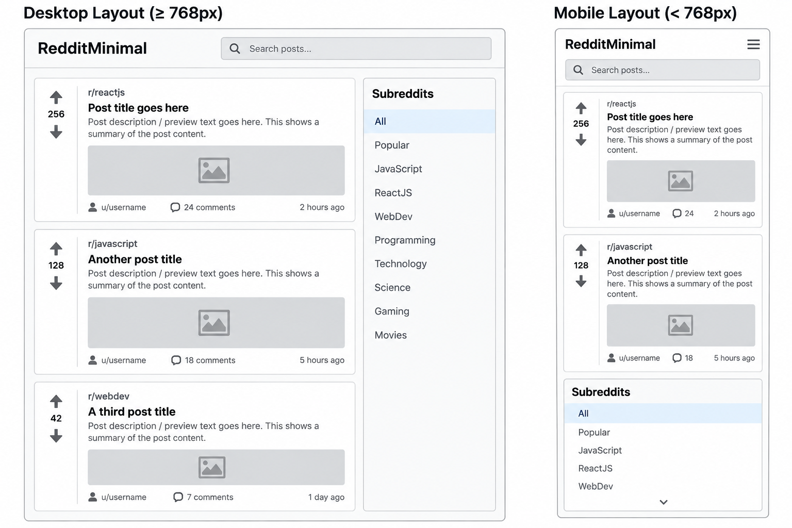

# RedditMinimal

RedditMinimal is a responsive Reddit-style web application built with React and Redux. It allows users to browse posts, search for content, filter posts by subreddit, vote on posts, view comments, and open posts in a detailed modal view.

This project was created as part of the Codecademy Full Stack Engineer portfolio project.

## Live Demo

The deployed application is available through GitHub Pages.
https://thomasearll-shand.github.io/Reddit-Client/


## Features

- Browse a feed of Reddit-style posts
- Search posts by keyword
- Filter posts by subreddit
- Upvote and downvote posts
- View comments on posts
- Open posts in a detailed modal
- Loading and error states
- Retry after a data-loading error
- Responsive layout for desktop, tablet, and mobile devices

## Technologies Used

- React
- Redux Toolkit
- React Redux
- JavaScript
- HTML
- CSS
- Jest
- React Testing Library
- Playwright
- Git
- GitHub
- GitHub Projects

## Testing

The application includes both unit tests and end-to-end tests.

Cross-browser testing was performed with Playwright across Chromium, Firefox, and WebKit, with all 12 tests passing.

### Lighthouse

The deployed application was audited using Google Lighthouse.

Desktop scores:

- Performance: 96
- Accessibility: 100
- Best Practices: 100
- SEO: 100

All Lighthouse categories achieved a score above 90.

### Unit Testing

Unit and component tests are written using Jest and React Testing Library.

The test suite covers:

- Rendering the search bar
- Updating the search term when a user types
- Rendering and selecting subreddits
- Rendering post details
- Upvoting and downvoting posts through Redux
- Rendering the post modal
- Closing the post modal
- Displaying comments in the post modal

The project currently has 10 passing unit tests.

React Testing Library was used instead of Enzyme because the project uses React 19, which is not properly supported by Enzyme. React Testing Library provides a modern approach to testing React components by testing behaviour from the user's perspective.

### End-to-End Testing 

Playwright is used for end-to-end testing.

The end-to-end tests cover:

- Loading the application and displaying content
- Searching for posts
- Filtering posts by subreddit
- Opening and closing the detailed post modal

The project currently has 4 passing end-to-end tests.

Unit tests can be run with:

```bash
npm test
```

## Reddit API and Data

The application is structured around Reddit-style post data.

During development, an attempt was made to retrieve data directly from Reddit's unauthenticated JSON endpoints. However, the requests returned HTTP 403/CORS errors in the browser.

To keep the application functional and demonstrate the complete data flow, the project currently uses local mock data stored in `public/mockPosts.json`. The mock data follows a Reddit-style structure and is loaded asynchronously through Redux.

Using live Reddit data could be added in the future if a suitable supported API integration is available.

## Future Work

Future improvements to RedditMinimal could include:

- Integration with a supported live Reddit API
- Live Reddit comments and subreddit data
- User authentication
- Persistent voting
- Additional sorting options such as hot, new, and top posts
- Improved accessibility features
- Additional animations and interface polish

## Wireframes

The wireframe below shows the planned layout for RedditMinimal on desktop and mobile devices. The desktop design uses a two-column layout with the post feed alongside subreddit navigation, while the mobile design stacks the content into a single column.



## Running the Project Locally

To run RedditMinimal locally, clone the repository and install the project dependencies.

```bash
git clone https://github.com/ThomasEarll-Shand/Reddit-Client.git
cd reddit-client
npm install
npm start
```

The application will then run locally at `http://localhost:3000`.

### Running Unit Tests

Run the Jest test suite with:

```bash
npm test
```

### Running End-to-End Tests

Start the application:

```bash
npm start
```

Then, in a second terminal, run the Playwright tests:

```bash
npx playwright test
```